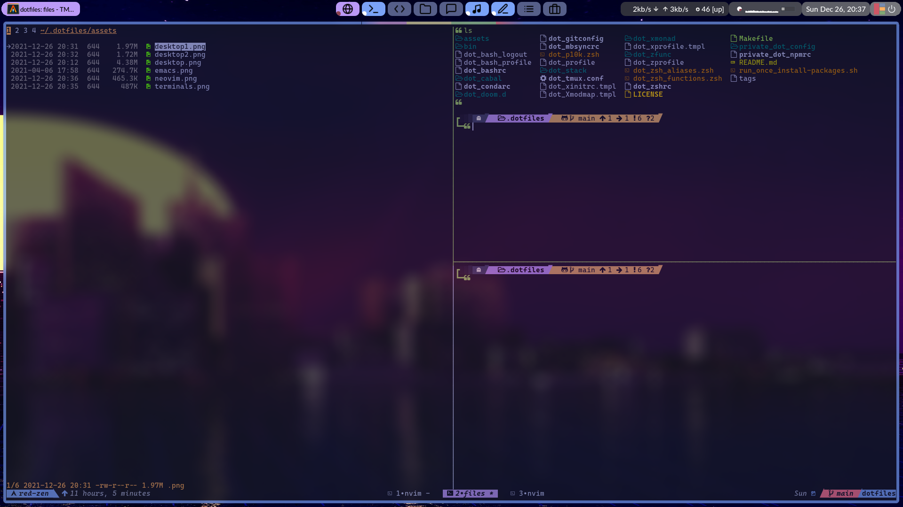
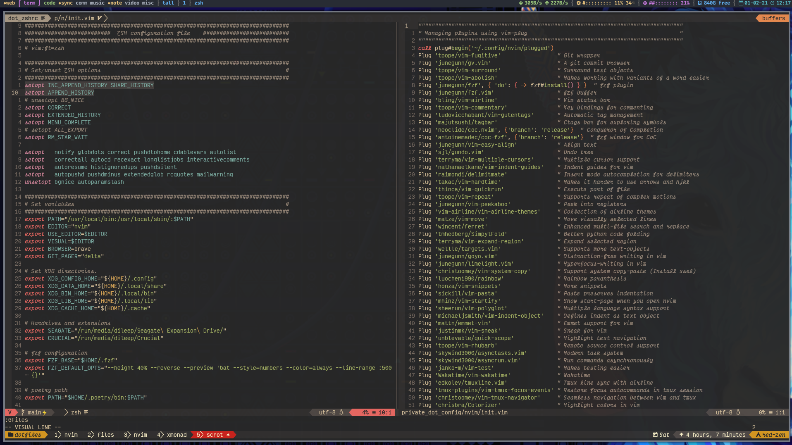
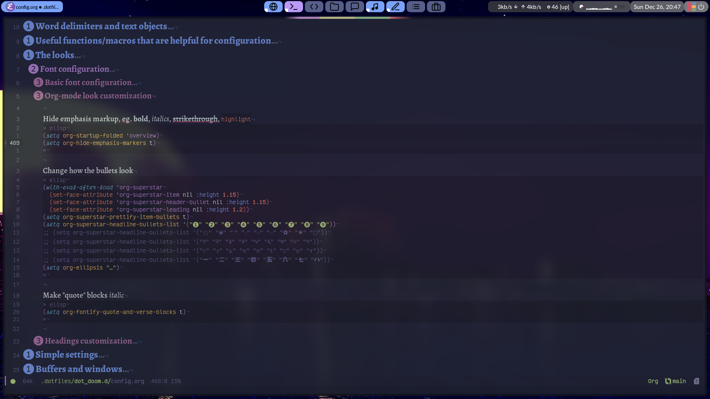

<h1 align="center">
    <a name="top" title="dotfiles">
        ~/.dotfiles
    </a>
    <br/>
    <sup>
        <sub>Powered by <a href="https://www.chezmoi.io/">chezmoi</a>  </sub>
        <br/>
        <sub>
            
            
        </sub>
    </sup>
</h1>


<div align="center">
    Dotfiles for my <a href="(https://xmonad.org/)">Xmonad</a> setup on my <a href="https://archlinux.org">Arch Linux</a> system, managed by <a href="https://github.com/twpayne/chezmoi">chezmoi</a>
    <p><strong>Be sure to <a href="#" title="star">⭐️</a> or <a href="#" title="fork">🔱</a> this repo if you find it useful! 😃</strong></p>
</div>

## Setup

-   `Arch Linux` (any other Arch based distribution should also work)
-   `Xmonad` desktop environment with `Xmobar` status bar
-   `Zsh` as the default shell with `Zinit` as the plugin manager and `Starship` for the prompt
-   `Emacs` as the default text editor using the `Doom Emacs` distribution
-   `Neovim` as the terminal text editor managed with `vim-plug`
-   Current theme: `Gruvbox`
-   Current terminals: `Alacritty` and `Kitty` (default for now because I love my ligatures) with `tmux`

## Screenshots

|           | Image                     |
| --------- | ------------------------- |
| Desktop   |    |
| Terminals |  |
| Neovim    |     |
| Doom Emacs    |     |

## Installation

```sh
chezmoi init https://github.com/dileep-kishore/dotfiles
```

The [dependency script](run_once_install-packages.sh) only supports `Arch Linux` and its derivatives.
If you install the dependencies manually, then the `dotfiles` can be used in any `Linux` setup.

> NOTE:
> You might want to turn off the shutter scripts (killer.sh) in `.xprofile` and `xmonad.hs`

## Packages

| Name      | Details                                         |
| --------- | ----------------------------------------------- |
| Nitrogen  | Wallpaper manager                               |
| rofi      | Application launcher and window switcher        |
| ranger    | File explorer                                   |
| Syncthing | Synchronize files between two or more computers |
| Barrier   | Share mouse and keyboard                        |
| Brave     | Browser                                         |
| Enhacd    | A better cd with interactive filtering          |
| Forgit    | A utility to use git interactively              |
| fzf       | Fuzzy search and interactive filtering          |
| fd        | A better alternative to find                    |
| bat       | A better alternative to cat                     |
| lsd       | The next generation ls command                  |
| noti      | Send notifications from the terminal            |
| sad       | CLI search and replace                          |
| sd        | CLI search and replace                          |
| ripgrep   | A better alternative to grep                    |
| delta     | A git pager                                     |
| zoxide    | Jump between directories in zsh                 |

## Credits

-   Chezmoi
-   Derek Taylor's [dotfiles](https://gitlab.com/dwt1/dotfiles) for `Xmonad` configuration
