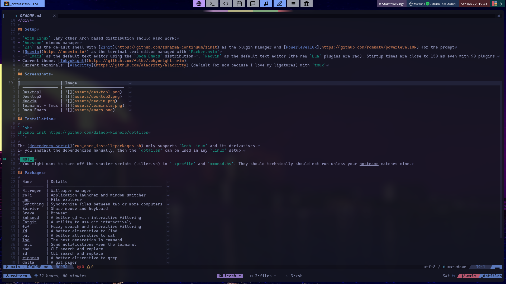
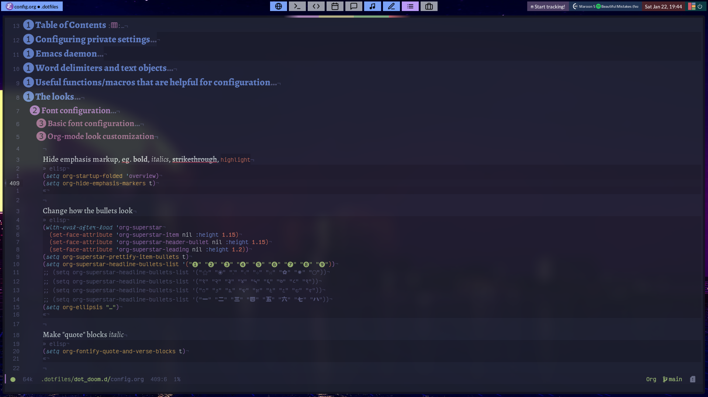

<h1 align="center">
    <a name="top" title="dotfiles">
        ~/.dotfiles
    </a>
    <br/>
    <sup>
        <sub>Powered by <a href="https://www.chezmoi.io/">chezmoi</a>  </sub>
        <br/>
        <sub>
            
            
        </sub>
    </sup>
</h1>


<div align="center">
    Dotfiles for my <strike><a href="https://xmonad.org/">Xmonad</a></strike> <a href="https://awesomewm.org/">AwesomeWM</a> setup on my <a href="https://archlinux.org">Arch Linux</a> system, managed by <a href="https://github.com/twpayne/chezmoi">chezmoi</a>
    <p><strong>Be sure to <a href="#" title="star">⭐️</a> or <a href="#" title="fork">🔱</a> this repo if you find it useful! 😃</strong></p>
</div>

## Setup

- `Arch Linux` (any other Arch based distribution should also work)
- `Awesome` window manager
- `Zsh` as the default shell with [Zinit](https://github.com/zdharma-continuum/zinit) as the plugin manager and [Powerlevel10k](https://github.com/romkatv/powerlevel10k) for the prompt
- [Neovim](https://neovim.io/) as the terminal text editor managed with `Packer.nvim`
- ~~`Emacs` as the default text editor using the `Doom Emacs` distribution~~. `Neovim` as the default text editor (the new `Lua` plugins are rad). Startup times are close to 150 ms even with 90 plugins.
- Current theme: [TokyoNight](https://github.com/folke/tokyonight.nvim)
- Current terminals: [Alacritty](https://github.com/alacritty/alacritty) (default for now because I love my ligatures) with `tmux`

## Screenshots

|                        | Image                     |
| ---------------------- | ------------------------- |
| Desktop1               |   |
| Desktop2               |   |
| Neovim                 |     |
| Terminal + Tmux        |  |
| Doom Emacs             |      |
| Both screens + Spotify |    |

## Installation

```sh
chezmoi init https://github.com/dileep-kishore/dotfiles
```

The [dependency script](run_once_install-packages.sh) only supports `Arch Linux` and its derivatives.
If you install the dependencies manually, then the `dotfiles` can be used in any `Linux` setup.

> NOTE:
> You might want to turn off the shutter scripts (killer.sh) in `.xprofile` and `xmonad.hs`. They should technically should not run unless your hostname matches mine.

## Packages

| Name         | Details                                         |
| ------------ | ----------------------------------------------- |
| Nitrogen     | Wallpaper manager                               |
| rofi         | Application launcher and window switcher        |
| ~~nnn~~ xplr | File explorer                                   |
| Syncthing    | Synchronize files between two or more computers |
| Barrier      | Share mouse and keyboard                        |
| Brave        | Browser                                         |
| Enhancd      | A better cd with interactive filtering          |
| Forgit       | A utility to use git interactively              |
| fzf          | Fuzzy search and interactive filtering          |
| fd           | A better alternative to find                    |
| bat          | A better alternative to cat                     |
| lsd          | The next generation ls command                  |
| noti         | Send notifications from the terminal            |
| sad          | CLI search and replace                          |
| sd           | CLI search and replace                          |
| ripgrep      | A better alternative to grep                    |
| delta        | A git pager                                     |
| zoxide       | Jump between directories in zsh                 |
| atuin        | zsh history navigation                          |
| espanso      | For text expansion                              |

## Credits

- Chezmoi
- suconakh for his modural [awesome-rc](https://github.com/suconakh/awesome-awesome-rc) which was a great starting point for me
- WillPower3309 for his [awesome-dotfiles](https://github.com/WillPower3309/awesome-dotfiles)
- LunarVim for a great reference point for [building a Neovim config from scratch](https://github.com/LunarVim/Neovim-from-scratch)
- Derek Taylor's [dotfiles](https://gitlab.com/dwt1/dotfiles) for `Xmonad` configuration
